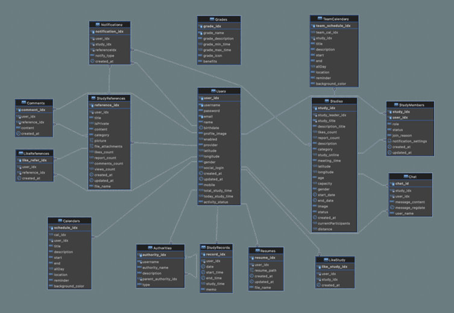
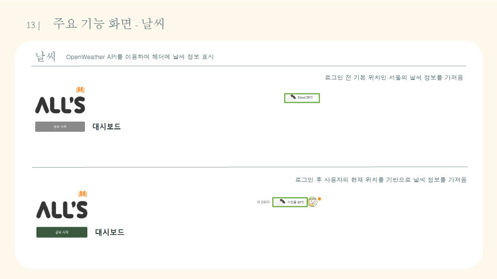
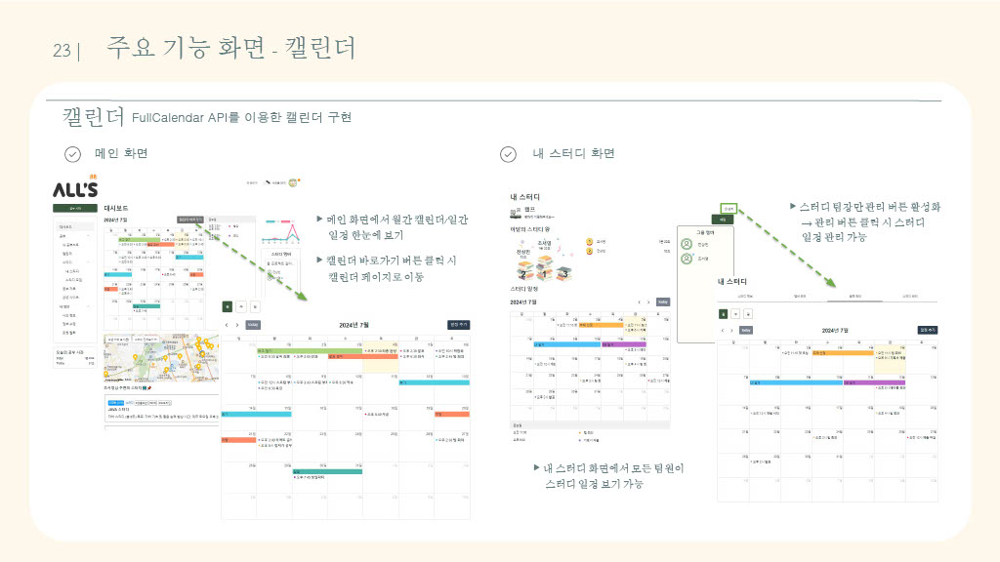
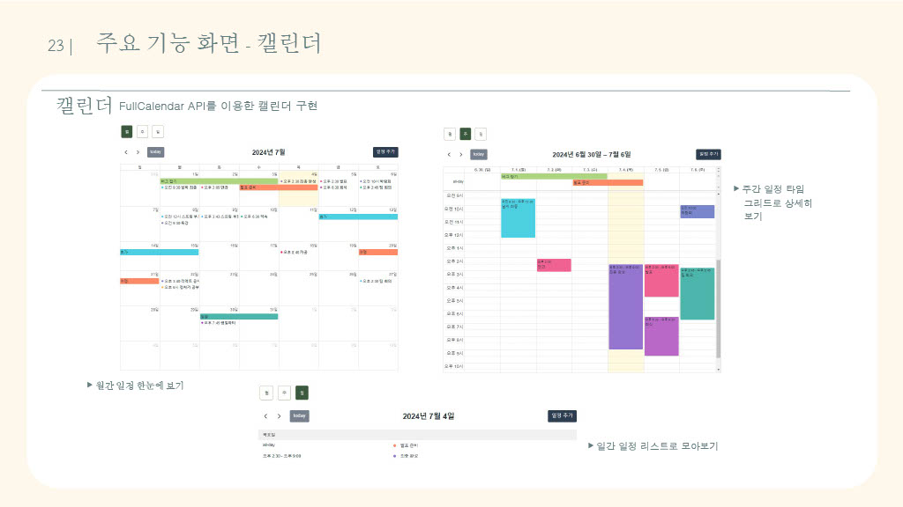
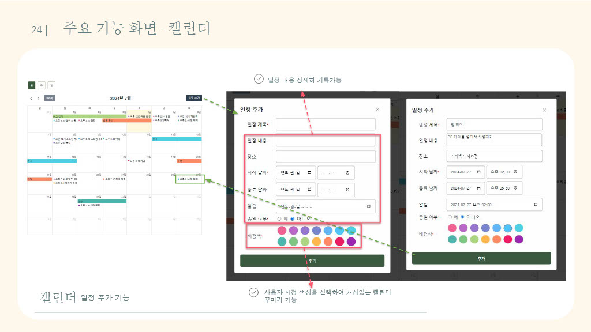
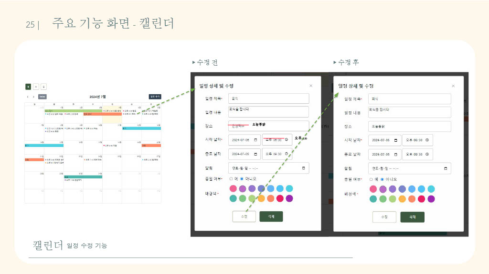
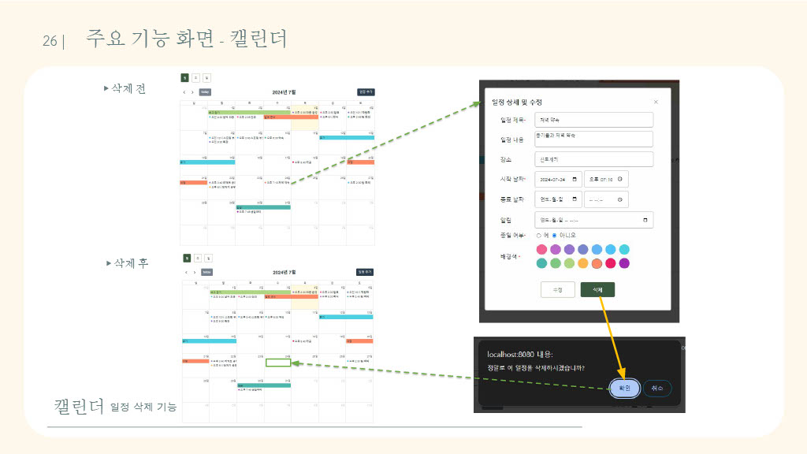

# All’s 📗

## ✅ 프로젝트 소개

- 프로젝트명: All’s

- 프로젝트 기간: 2024.6.1 ~ 2024.7.5 (5주)

- 팀원: 전상민, 신지현, 손유정, 송예준, 조서영, 최재원

 

## ✅ 기획 배경 및 소개

코로나 이후 비대면 만남이 일상화되어 온라인 스터디가 활발해진 요즘 개발자 취업을 위해 함께 공부할 수 있는 스터디 플랫폼의 필요성을 느낌

기존에 없는 **개인 학습 관리, 스터디 그룹 생성 및 관리, 자료 공유 등의 기능을 통합적으로 제공하는 스터디 플랫폼**을 직접 개발하기로 함

 

📍 **내 주변 스터디 찾기** 

- 지도 API 기반 내 주변 스터디 확인

⏱️ **내 공부 시간 측정** 

- 공부 시간에 따른 스터디 그룹 내 랭킹 시스템
- 타이머를 통한 공부 시간 측정, 주간/월간 공부 시간 그래프 시각화

🗓️ **내 공부 일정 관리**

- 공부 일정을 기록하고, 월간/주간/일간 일정 확인

- 캘린더 API기반 일정 관리 및 공유

👥 **스터디 그룹 공유**

- 공통의 목표와 공부 시간 랭킹을 통한 자극

 

## ✅ 기술 스택

   
  
  
   
   
   
   
  
   
  
  
   
  
  
  
   

 

### ERD
  

 

## ✅ 주요 구현 내용

**💻 Google 소셜 로그인**

- Google 소셜 로그인 API를 이용한 OAuth2 로그인 구현

📅 **캘린더**

- FullCalendar API를 활용한 개인별, 스터디별 월/주/일간 캘린더 구현
- 캘린더 일정 CRUD

**🧑🏻‍💼 관리자 페이지**

- 사용자 권한 설정
- 웹 정보, 사용자/스터디/게시판 관리

 

### 날씨 기능 화면
  

 

### 캘린더 기능 화면
  
  
  
  
  
